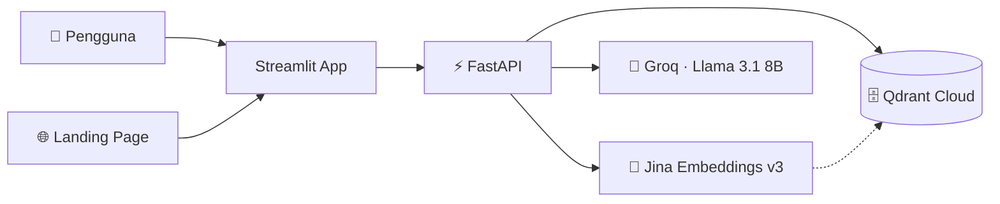

# ✦ Cendekia · Kecerdasan Nusantara

> Kecerdasan yang tenang, jawaban yang bercahaya.

**Cendekia** adalah asisten riset AI berbasis **RAG (Retrieval-Augmented Generation)**: unggah sebuah dokumen PDF, lalu ajukan pertanyaan dalam bahasa natural dan dapatkan jawaban yang **berdasar pada isi dokumen** — lengkap dengan sumbernya, tanpa mengarang.

<p>
  <a href="https://asisten-riset-ai.streamlit.app/"><b>🚀 Coba Aplikasi Live</b></a>
</p>

---

## ✨ Fitur Utama

- 📄 **Tanya-jawab dokumen** — unggah PDF, tanyakan apa saja tentang isinya.
- 🎯 **Jawaban berdasar sumber** — setiap jawaban dapat ditelusuri ke potongan dokumen aslinya.
- 🛡️ **Anti-halusinasi** — jika informasi tidak ada di dokumen, sistem jujur menolak menjawab.
- ⚡ **Streaming** — jawaban muncul kata demi kata secara real-time.
- 🎨 **Antarmuka premium** — tema "Cendekia" (obsidian & emas) dengan animasi halus.
- 🧪 **Teruji** — kualitas RAG diukur otomatis dengan harness evaluasi + LLM-as-judge.

---

## 🏗️ Arsitektur



Alur singkat:

1. **Ingest** — PDF dipotong menjadi *chunks* → di-*embed* dengan Jina (vektor 1024 dimensi) → disimpan di Qdrant.
2. **Query** — pertanyaan di-*embed* → pencarian *cosine similarity* di Qdrant → ambil potongan paling relevan (Top-K).
3. **Generate** — potongan relevan + pertanyaan dikirim ke Groq (Llama 3.1) → jawaban di-*stream* ke pengguna.

---

## 🧰 Tech Stack

| Lapisan | Teknologi |
|---|---|
| Aplikasi | **Streamlit** |
| Landing page | HTML + CSS + JavaScript (vanilla) |
| Backend API | **FastAPI** |
| Vector Database | **Qdrant Cloud** |
| Embeddings | **Jina Embeddings v3** (1024-dim) |
| LLM | **Groq** · Llama 3.1 8B Instant |
| Evaluasi (juri) | Llama 3.3 70B (LLM-as-judge) |
| Bahasa | **Python** |

---

## 📊 Evaluasi Kualitas RAG

Sistem ini tidak sekadar "jalan" — kualitasnya **diukur secara objektif** lewat `evaluasi.py`, yang menguji 7 pertanyaan (termasuk 1 pertanyaan jebakan di luar dokumen) dengan 4 metrik. Dua di antaranya dinilai oleh **LLM-as-judge**.

### Perjalanan optimasi (metode ilmiah)

| Iterasi | Retrieval Hit | Answer Accuracy | Perubahan |
|---|:--:|:--:|---|
| 1️⃣ Baseline | 66.7% | 50.0% | Pengukuran awal |
| 2️⃣ Perbaikan data | 83.3% | 66.7% | Menguji basis pengetahuan lengkap |
| 3️⃣ Tuning | **100%** | **100%** | `TOP_K` 3→5 + prompt dipertajam |

### Skor final

| Metrik | Skor |
|---|:--:|
| Retrieval Hit Rate | **100%** (6/6) |
| Answer Accuracy | **100%** (6/6) |
| Penolakan benar (anti-halusinasi) | **100%** (1/1) |
| Faithfulness (juri) | **5.00 / 5** |
| Relevance (juri) | **4.43 / 5** |

> **Faithfulness 5.00/5** membuktikan sistem tidak pernah mengarang. Relevance 4.43 disebabkan pertanyaan di luar dokumen yang **sengaja** dijawab "Tidak ada di dokumen" — perilaku yang benar untuk mencegah halusinasi.

Laporan lengkap dihasilkan otomatis ke [`LAPORAN_EVALUASI.md`](./LAPORAN_EVALUASI.md).

---

## 🚀 Menjalankan Secara Lokal

### 1. Prasyarat

- Python 3.10+
- API key: **Groq**, **Jina**, dan **Qdrant Cloud**

### 2. Instalasi

```bash
git clone https://github.com/michaelalinskie11/asisten-riset-ai.git
cd asisten-riset-ai
python -m venv venv
# Windows:
.\venv\Scripts\Activate.ps1
# macOS/Linux:
# source venv/bin/activate
python -m pip install -r requirements.txt
```

### 3. Konfigurasi `.env`

```env
GROQ_API_KEY=xxx
JINA_API_KEY=xxx
QDRANT_URL=xxx
QDRANT_API_KEY=xxx
```

### 4. Jalankan

```bash
# Aplikasi Streamlit
streamlit run app.py

# Backend API (opsional)
python -m uvicorn main:app --reload   # dokumentasi di http://127.0.0.1:8000/docs

# Evaluasi kualitas RAG
python evaluasi.py
```

---

## 📁 Struktur Proyek

```
asisten-riset-ai/
├─ app.py               # Aplikasi Streamlit (RAG + antarmuka Cendekia)
├─ main.py              # Backend FastAPI (upload, tanya, health)
├─ indeks_qdrant.py     # Skrip indexing dokumen ke Qdrant
├─ evaluasi.py          # Harness evaluasi RAG + LLM-as-judge
├─ LAPORAN_EVALUASI.md  # Laporan skor (dihasilkan otomatis)
├─ requirements.txt
├─ .streamlit/
│  └─ config.toml       # Tema Cendekia
└─ cendekia-lux/        # Landing page mewah
```

---

## 🗺️ Roadmap

- [x] **Fase 1** — Integrasi LLM (Groq)
- [x] **Fase 2** — RAG + antarmuka Streamlit
- [x] **Fase 3** — Backend FastAPI + Qdrant Cloud
- [x] **Fase 5** — Evaluasi kualitas RAG (metrik + LLM-as-judge)
- [ ] **Fase 6** — Kemampuan agentik (multi-langkah + tools)
- [ ] **Fase 7** — Deployment penuh backend

---

## 👤 Penulis

**Michael Alinskie** — dibangun sebagai proyek portofolio AI/LLM Engineering.

---

<p align="center"><i>Cendekia · Dari dokumen, menjadi kejelasan.</i></p>
